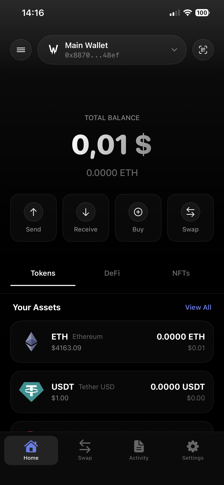

# Wpayin Wallet - Multi-Chain Crypto Wallet (v1.1.0)

A comprehensive, secure, and feature-rich cryptocurrency wallet for iOS built with SwiftUI and Trust Wallet Core. Wpayin Wallet supports Bitcoin, Ethereum, ERC-20 tokens, NFTs, DeFi protocols, and token swaps with an elegant black/white/blue design.

<p align="center">
  
</p>

## 🆕 What's New in Version 1.1.0

### 🪙 Bitcoin Support
- **Native SegWit (BIP84)**: `bc1...` addresses with lowest transaction fees
- **Full Bitcoin Integration**: Balance viewing, sending, and receiving
- **WalletCore Derivation**: Industry-standard BIP39/BIP44/BIP84 implementation
- **Real-time Balance**: Direct blockchain queries via Blockstream API

### 🔄 Real Token Swapping (DEX Integration)
- **DEX Router Support**: Uniswap V2, PancakeSwap, QuickSwap, SushiSwap
- **Multi-Chain Swaps**: Works on all EVM chains (Ethereum, BSC, Polygon, etc.)
- **Slippage Protection**: Configurable slippage tolerance (0.1% - 5%)
- **Gas Optimization**: Automatic gas estimation and fee calculation
- **Quote System**: Real-time swap quotes with price impact analysis

### 💸 Real Transaction Sending
- **Native Token Support**: Send ETH, BNB, MATIC, AVAX, etc.
- **ERC-20 Transfers**: Full support for token transfers
- **EIP-1559 Support**: Modern gas fee system for Ethereum
- **Legacy Gas**: Support for BSC and older chains
- **Transaction Signing**: Secure EIP-155 signing with WalletCore

### 🌐 Advanced Network Management
- **Multiple RPC Sources**: Automatic failover between RPC providers
- **Network Switching**: Easy toggle between blockchains
- **Custom RPC**: Support for custom RPC endpoints (future)
- **Gas Price Intelligence**: 
  - EIP-1559: Dynamic base fee + priority fee
  - Legacy: Smart gas price estimation
  - Safety warnings for too low/high fees

### 👛 Multi-Account Wallet System
- **HD Wallet Support**: Create multiple accounts from single seed phrase
- **MetaMask Compatible**: m/44'/60'/0'/0/{index} derivation
- **Independent Addresses**: Each account has unique addresses per blockchain
- **Easy Switching**: Quick account selector in UI
- **Account Management**: Create, rename, and organize accounts

### 🎨 Token Icon Preservation
- **Persistent Icons**: Token icons never lost during updates
- **Fallback System**: Default icons when API fails
- **CoinGecko Integration**: High-quality token logos
- **Smart Merging**: Intelligent token data merging

### 🔧 Technical Improvements
- **Zero Compiler Warnings**: Clean, production-ready code
- **Concurrency Safety**: Proper Swift 6 actor isolation
- **Memory Efficiency**: Optimized token caching and filtering
- **Better Error Handling**: Comprehensive error messages

## Features

### 🔐 Security First
- **Secure Key Storage**: Private keys and seed phrases stored in iOS Keychain
- **Biometric Authentication**: Face ID / Touch ID support
- **BIP39 Compatible**: 12-word mnemonic generation and import
- **Multi-Chain Support**: Bitcoin, Ethereum, and all EVM-compatible chains
- **Non-Custodial**: You control your keys, always
- **HD Wallet**: Industry-standard BIP32/44/84 derivation

### 💎 Token Management
- **Multi-Blockchain**: Bitcoin, Ethereum, BSC, Polygon, Arbitrum, Optimism, Avalanche, Base
- **ERC-20 Support**: Full support for Ethereum and EVM token standards
- **Custom Tokens**: Add any ERC-20 token by contract address with auto-fetch
- **Real-Time Prices**: Live price data from CoinGecko
- **Balance Tracking**: Track portfolio value across all tokens and chains
- **Token Import/Export**: Easy token management
- **Icon Preservation**: Tokens keep their icons across updates

### 🪙 Bitcoin Features
- **Native SegWit**: bc1... addresses (BIP84) with lowest fees
- **Real Balance**: Live balance from Blockstream API
- **Send/Receive**: Full transaction support
- **Fee Tiers**: Slow/Standard/Fast (10/20/40 sat/vB)
- **Multi-Account**: Unique Bitcoin address per account

### 💱 DeFi & Swap
- **Real DEX Swaps**: Actual on-chain token exchanges
- **Multi-DEX Support**: Uniswap, PancakeSwap, QuickSwap, SushiSwap
- **Gas Estimation**: Accurate gas fee calculation
- **Slippage Protection**: Customizable slippage tolerance
- **Price Impact**: Real-time swap quote analysis
- **Multi-Chain**: Swap on any EVM chain

### 🎨 NFT Support
- **NFT Gallery**: View your NFT collection
- **Metadata Display**: Full NFT metadata with images
- **Alchemy Integration**: Reliable NFT data via Alchemy API

### 📱 User Experience
- **Multi-Wallet Support**: Create and manage multiple accounts
- **QR Code Scanning**: Quick address input and deposit
- **Transaction History**: Full transaction history with Etherscan integration
- **Multi-Language Support**: English, Czech, Spanish, French, Japanese, Korean, Chinese
- **Dark Theme**: Elegant black-based design optimized for OLED
- **Blockchain Filtering**: Show/hide tokens by blockchain

## Requirements

- **iOS**: 15.0 or later
- **Xcode**: 15.0 or later
- **Swift**: 5.9 or later
- **Device**: iPhone or iPad

## Installation

### 1. Clone the Repository

```bash
git clone https://github.com/Lakylife/wpayin-erc20-ios-app.git
cd wpayin-erc20-ios-app
```

### 2. Configure API Keys

The app requires API keys for full functionality. These are **not included** in the repository for security reasons.

#### Step-by-step Configuration:

1. **Copy the template file**:
   ```bash
   cp Wpayin_Wallet/Core/Config/Config.swift.template Wpayin_Wallet/Core/Config/Config.swift
   ```

2. **Get your API keys**:

   - **Alchemy API** (Required for NFTs):
     - Sign up at [https://www.alchemy.com/](https://www.alchemy.com/)
     - Create a new app (select Ethereum Mainnet)
     - Copy your API key

   - **Etherscan API** (Required for transaction history):
     - Sign up at [https://etherscan.io/](https://etherscan.io/)
     - Go to API Keys section
     - Create a new API key
     - Copy your API key

3. **Update Config.swift**:
   ```swift
   // Replace these values in Config.swift:
   static let alchemyApiKey = "YOUR_ALCHEMY_API_KEY"
   static let etherscanApiKey = "YOUR_ETHERSCAN_API_KEY"
   ```

4. **Optional - Custom RPC endpoints**:
   ```swift
   // You can also customize RPC URLs for better performance:
   static let ethereumRpcUrl = "https://eth-mainnet.g.alchemy.com/v2/YOUR_API_KEY"
   ```

> **Note**: `Config.swift` is in `.gitignore` and will **never** be committed to Git. Keep your API keys secret!

### 3. Install Dependencies

The project uses Swift Package Manager for dependencies. Xcode will automatically resolve and download them when you open the project.

```bash
open Wpayin_Wallet.xcodeproj
```

Dependencies include:
- **WalletCore** (Trust Wallet Core) - HD wallet and key management
- **web3swift** - Ethereum interactions
- **CryptoSwift** - Cryptographic functions
- **BigInt** - Large number handling
- **secp256k1** - Elliptic curve cryptography

### 4. Build and Run

1. Open `Wpayin_Wallet.xcodeproj` in Xcode
2. Select your target device or simulator
3. Press **Cmd + B** to build
4. Press **Cmd + R** to run

Or use the command line:

```bash
xcodebuild -project Wpayin_Wallet.xcodeproj \
  -scheme Wpayin_Wallet \
  -destination 'platform=iOS Simulator,name=iPhone 15' \
  build
```

## Architecture

### Project Structure

```
Wpayin_Wallet/
├── Core/
│   ├── API/              # APIService for blockchain and price data
│   ├── Config/           # Configuration (API keys) - gitignored
│   ├── Extensions/       # Swift extensions
│   ├── Localization/     # Multi-language support
│   ├── Managers/         # WalletManager, KeychainManager
│   └── Theme/            # WpayinColors, design system
├── Models/               # Token, Transaction, Blockchain models
├── Views/
│   ├── Welcome/          # Onboarding flow
│   ├── Wallet/           # Wallet creation, import, main view
│   ├── Components/       # Reusable UI components
│   ├── Main/             # Tab navigation
│   ├── Swap/             # Token swap interface
│   ├── Activity/         # Transaction history
│   ├── DeFi/             # DeFi protocols
│   └── Settings/         # App settings, security
└── Resources/            # Localization strings, assets
```

### Key Technologies

- **SwiftUI**: Modern declarative UI framework
- **Combine**: Reactive programming for state management
- **WalletCore**: BIP32/BIP39/BIP44 HD wallet implementation
- **Keychain**: Secure storage for private keys
- **JSON-RPC**: Direct blockchain interaction
- **REST APIs**: CoinGecko (prices), Alchemy (NFTs), Etherscan (transactions)

### State Management

- **WalletManager**: Central `@ObservableObject` managing wallet state
- **Environment Objects**: Shared across SwiftUI view hierarchy
- **UserDefaults**: Multi-wallet configurations, custom tokens
- **Keychain**: Secure cryptographic material storage

## Security Considerations

### Best Practices

✅ **DO**:
- Keep your seed phrase/private key backed up offline
- Use biometric authentication when available
- Verify recipient addresses before sending
- Start with small test transactions
- Keep the app updated

❌ **DON'T**:
- Share your seed phrase or private key with anyone
- Take screenshots of your seed phrase
- Store seed phrases in cloud services
- Use the wallet on jailbroken devices
- Commit `Config.swift` with API keys to version control

### Development Security

- **No Hardcoded Keys**: All API keys loaded from `Config.swift` (gitignored)
- **Keychain Storage**: Private keys never stored in plain text
- **Memory Safety**: Sensitive data cleared after use
- **Biometric Protection**: Optional Face ID/Touch ID for access

> ⚠️ **Important**: This wallet is for educational and personal use. For production use with significant funds, a professional security audit is strongly recommended.

## Development

### Running Tests

```bash
xcodebuild -project Wpayin_Wallet.xcodeproj \
  -scheme Wpayin_Wallet \
  -destination 'platform=iOS Simulator,name=iPhone 15' \
  test
```

### Building for Release

```bash
xcodebuild -project Wpayin_Wallet.xcodeproj \
  -scheme Wpayin_Wallet \
  -configuration Release \
  -destination 'generic/platform=iOS' \
  archive
```

## Configuration Options

### Feature Flags

You can enable/disable features in `Config.swift`:

```swift
struct AppConfig {
    static let nftEnabled = true        // Enable NFT functionality
    static let defiEnabled = true       // Enable DeFi features
    static let swapEnabled = true       // Enable token swaps
}
```

### Supported Networks

- **Bitcoin** (Native SegWit - bc1... addresses)
  - Mainnet support
  - BIP84 derivation (m/84'/0'/0'/0/index)
  - Lowest transaction fees
  - Real-time balance via Blockstream API

- **Ethereum** (Mainnet)
  - Full ERC-20 token support
  - EIP-1559 gas pricing
  - NFT support via Alchemy
  - Transaction history via Etherscan

- **Polygon** (MATIC)
  - Fast and cheap transactions
  - ERC-20 compatible
  - DeFi protocols support

- **Binance Smart Chain** (BSC)
  - BEP-20 token support
  - PancakeSwap integration
  - Legacy gas pricing

- **Arbitrum**
  - Layer 2 scaling solution
  - Low fees, fast confirmations
  - Full EVM compatibility

- **Optimism**
  - Optimistic rollup
  - Ethereum security
  - Lower costs

- **Avalanche C-Chain**
  - High throughput
  - Sub-second finality
  - EVM compatible

- **Base**
  - Coinbase's L2
  - Low fees
  - Growing ecosystem

## 📝 Changelog

### Version 1.1.0 (November 2024)

#### ✨ New Features
- 🪙 **Bitcoin Support**: Full integration with Native SegWit (BIP84) addresses
- 🔄 **Real Token Swaps**: DEX integration (Uniswap, PancakeSwap, QuickSwap, SushiSwap)
- 💸 **Real Transactions**: Send ETH, BTC, and ERC-20 tokens on-chain
- 🌐 **Network Manager**: Multi-RPC support with automatic failover
- 💰 **Gas Price Service**: EIP-1559 and Legacy gas price intelligence
- 👛 **Multi-Account System**: Create multiple accounts from one seed phrase
- 🎨 **Token Icon System**: Icons preserved during updates with fallback URLs

#### 🔧 Improvements
- ⚡ Optimized token merging - no data loss when switching blockchains
- 🎯 Smart blockchain filtering - show/hide specific chains
- 📊 Better balance calculation - respects active blockchains
- 🔐 Enhanced transaction signing with EIP-155
- 🌍 Multiple RPC sources for better reliability
- 💾 Intelligent token caching

#### 🐛 Bug Fixes
- ✅ Fixed: Tokens losing icons when adding/removing blockchains
- ✅ Fixed: All assets breaking when activating Bitcoin
- ✅ Fixed: Incorrect addresses shown in wallet selector
- ✅ Fixed: 9 compiler warnings (infinite recursion, unused variables, concurrency)
- ✅ Fixed: Icon preservation during token updates
- ✅ Fixed: Balance not updating when switching blockchains

#### 🏗️ Technical
- Clean build with zero warnings
- Swift 6 concurrency safety
- Proper actor isolation
- Memory optimization
- Better error handling
- Comprehensive documentation

### Version 1.0.0 (Initial Release)
- Initial release with Ethereum support
- ERC-20 token management
- NFT gallery
- Basic swap UI (demo)
- Multi-language support
- Dark theme

## Troubleshooting

### Build Errors

**Error**: `Cannot find type 'AppConfig'`
- **Solution**: Make sure you've created `Config.swift` from the template (see Installation step 2)

**Error**: `No such module 'WalletCore'`
- **Solution**: Wait for Xcode to finish resolving Swift packages, or go to File → Packages → Resolve Package Versions

### Runtime Issues

**NFTs not loading**:
- Check your Alchemy API key in `Config.swift`
- Verify you have an active internet connection
- Ensure the wallet has NFTs (test with a known NFT holder address)

**Transaction history empty**:
- Check your Etherscan API key in `Config.swift`
- Verify the wallet has transaction history on that chain
- Check API rate limits (free tier has restrictions)

**Prices showing $0.00**:
- CoinGecko may have rate limits on free tier
- Check internet connection
- Try refreshing the wallet view

## Contributing

Contributions are welcome! Please follow these guidelines:

1. **Fork** the repository
2. **Create** a feature branch (`git checkout -b feature/amazing-feature`)
3. **Commit** your changes (`git commit -m 'Add amazing feature'`)
4. **Push** to the branch (`git push origin feature/amazing-feature`)
5. **Open** a Pull Request

### Code Style

- Follow Swift naming conventions
- Use SwiftUI best practices
- Comment complex logic
- Update README for new features
- Test on both iPhone and iPad

## License

This project is licensed under the MIT License - see the [LICENSE](LICENSE) file for details.

## Acknowledgments

- **Trust Wallet Core**: For the excellent HD wallet library and Bitcoin support
- **Alchemy**: For reliable blockchain APIs
- **CoinGecko**: For comprehensive price data
- **Etherscan**: For transaction indexing
- **Blockstream**: For Bitcoin blockchain API
- **Mempool.space**: For Bitcoin fee estimation
- **Unstoppable Wallet**: For architecture inspiration
- **SwiftUI Community**: For patterns and best practices

## Roadmap

### Planned Features
- [ ] **Taproot Support**: BIP86 addresses (bc1p...)
- [ ] **Hardware Wallet**: Ledger/Trezor integration
- [ ] **Token Bridge**: Cross-chain token bridges
- [ ] **Advanced Charts**: Price history and analytics
- [ ] **Watch-Only Wallets**: Monitor addresses without private keys
- [ ] **Address Book**: Save frequently used addresses
- [ ] **Custom RPC**: User-defined RPC endpoints
- [ ] **Transaction Export**: CSV/PDF export for taxes
- [ ] **DApp Browser**: In-app Web3 browser
- [ ] **Staking**: Native staking for supported chains

### Under Consideration
- Lightning Network support
- Solana integration
- Multi-sig wallets
- Social recovery
- Fiat on/off ramps

## Documentation

For detailed documentation, see:
- [BLOCKCHAIN_MANAGEMENT_FIX.md](BLOCKCHAIN_MANAGEMENT_FIX.md) - How blockchain activation works
- [BITCOIN_ADDRESS_AND_ICONS_FIX.md](BITCOIN_ADDRESS_AND_ICONS_FIX.md) - Bitcoin address derivation and icon system
- [COMPILER_WARNINGS_FIXED.md](COMPILER_WARNINGS_FIXED.md) - All fixed compiler warnings
- [AGENTS.md](AGENTS.md) - Repository guidelines and coding standards

## Support

For issues, questions, or suggestions:

- **Issues**: [GitHub Issues](https://github.com/Lakylife/wpayin-erc20-ios-app/issues)
- **Discussions**: [GitHub Discussions](https://github.com/Lakylife/wpayin-erc20-ios-app/discussions)

## Disclaimer

This software is provided "as is", without warranty of any kind. Use at your own risk. The developers are not responsible for any loss of funds or data. Always test with small amounts first and keep backups of your seed phrase.

---

**Made with ❤️ for the decentralized future**

