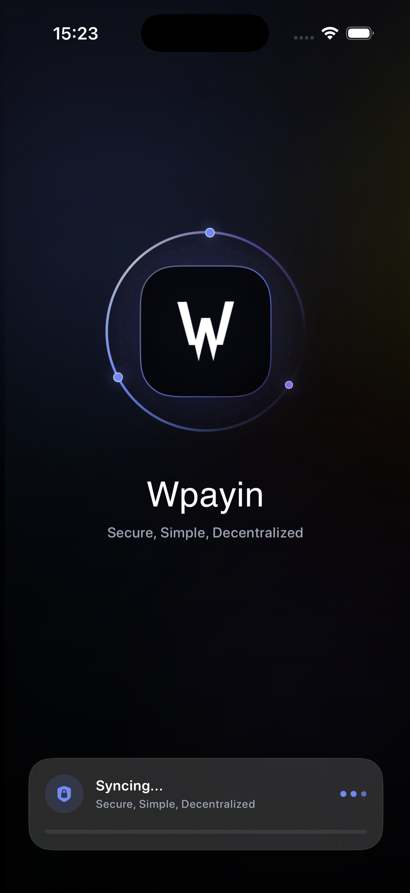
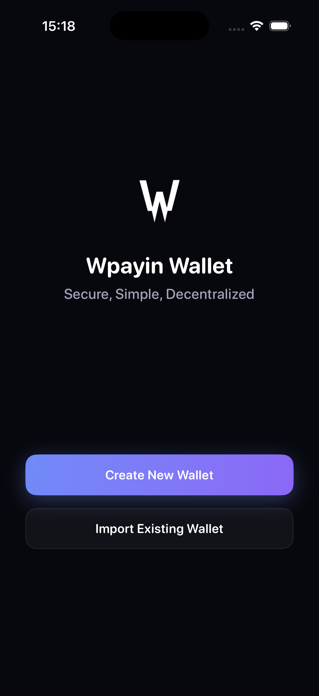
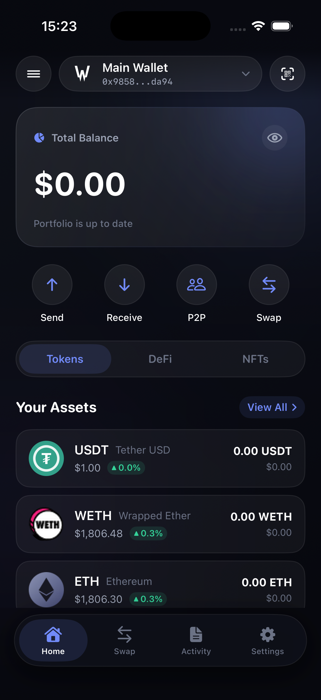
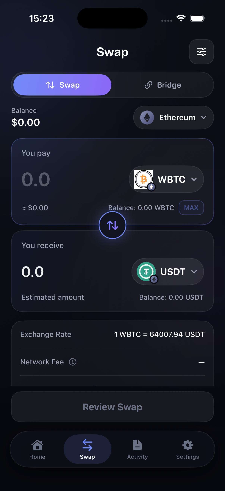
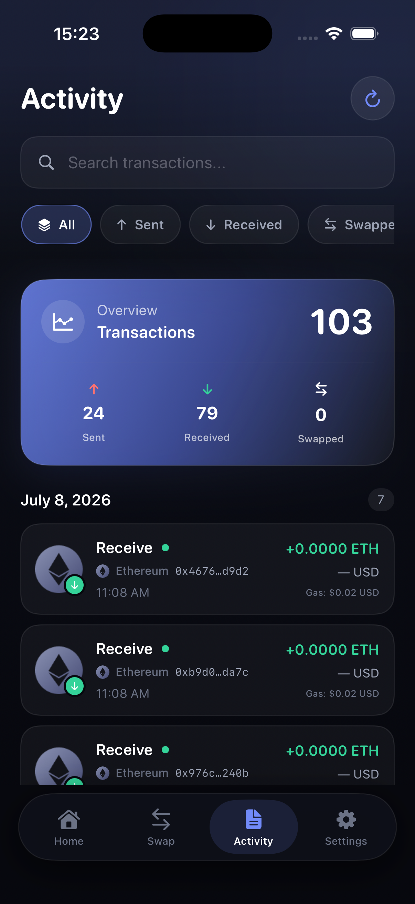
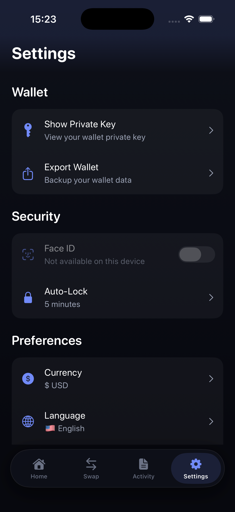

# Wpayin Wallet 1.1.8

Wpayin Wallet is a non-custodial iOS wallet built with SwiftUI and Trust
Wallet Core. It supports Bitcoin, Ethereum, Solana, EVM-compatible networks,
tokens, network-aware transaction history, NFTs, DEX swaps, cross-chain
bridging, and atomic EVM P2P trading.

> This project has not received a professional security audit. Use test
> accounts and small amounts only. You are responsible for protecting your
> recovery phrase and private keys.

<p align="center">
  
  
  
</p>
<p align="center">
  
  
  
</p>

## Version 1.1.8

- Added a branded launch experience and immediate restoration of last-known
  wallet balances while live chain data refreshes.
- Reworked Send with live gas prices, Slow/Standard/Fast selection, accurate
  Max calculations including gas, and preflight transaction simulation.
- Newly broadcast sends appear in Activity immediately with their hash,
  explorer link, pending progress, and automatic confirmed/failed updates.
- Wallet balances update optimistically after Send and reconcile with the
  blockchain as soon as the receipt is available.
- Improved swap, bridge, P2P, transaction history, localization, wallet
  switching, and multi-network reliability.
- Removed all service configuration values from source; optional integrations
  are supplied only through runtime environment variables.

See [RELEASE_NOTES_v1.1.8.md](RELEASE_NOTES_v1.1.8.md) for the complete
release notes.

## Requirements

- macOS with Xcode 16 or newer
- iOS 15.0 or newer
- An Apple development team for installation on a physical device

## Build and run

```bash
git clone https://github.com/Lakylife/wpayin-erc20-ios-app.git
cd wpayin-erc20-ios-app
open Wpayin_Wallet.xcodeproj
```

Xcode resolves the pinned Swift Package Manager dependencies automatically.
Select the `Wpayin_Wallet` scheme, choose an iPhone simulator, and press
`Cmd-R`.

The command-line equivalent is:

```bash
xcodebuild \
  -project Wpayin_Wallet.xcodeproj \
  -scheme Wpayin_Wallet \
  -destination 'generic/platform=iOS Simulator' \
  CODE_SIGNING_ALLOWED=NO \
  build
```

No configuration file needs to be copied or created. Public RPC endpoints and
keyless services provide the base wallet functionality.

## Optional API integrations

NFT discovery and indexed transaction history use optional third-party API
keys. In Xcode, open **Product → Scheme → Edit Scheme → Run → Arguments** and
add the required values under **Environment Variables**:

| Variable | Purpose |
| --- | --- |
| `ALCHEMY_API_KEY` | Ethereum NFT discovery |
| `ETHERSCAN_API_KEY` | Indexed EVM transaction history |
| `COINGECKO_API_KEY` | Optional authenticated CoinGecko access |
| `P2P_BOARD_URL` | Optional public P2P board endpoint |
| `P2P_BOARD_ANON_KEY` | Optional public P2P board client key |
| `PLATFORM_FEE_RECIPIENT` | Optional EVM platform-fee treasury address |

The app still builds and runs when these values are absent. Missing provider
keys disable only their corresponding optional data. Do not add credentials,
treasury addresses, or environment files to source control. Any value supplied
to an iOS application at runtime can still be extracted, so production
deployments should use restricted keys or a server-side proxy.

## Optional public P2P offer board

P2P offers can be public (discoverable by every app user) or private (shared
only by QR/code). The optional public board uses a separately configured
Supabase/PostgREST deployment; setup is documented in
[`docs/P2P_OFFER_BOARD.md`](docs/P2P_OFFER_BOARD.md). Private QR/code trading
continues to work when the board is not configured.

## Supported networks

- Bitcoin (Native SegWit/BIP84)
- Ethereum
- Solana
- BNB Chain
- Polygon
- Arbitrum
- Optimism
- Avalanche C-Chain
- Base

Cross-chain bridging is available between the supported EVM networks listed
above through LI.FI. Native Bitcoin and Solana cannot participate in atomic
EVM P2P settlement; supported wrapped representations include WBTC, cbBTC,
BTCB, and BTC.b where available.

## Project layout

```text
Wpayin_Wallet/
├── Assets.xcassets/
├── Core/
│   ├── API/
│   ├── Config/
│   ├── Managers/
│   └── Services/
├── Models/
├── Resources/
└── Views/
Wpayin_WalletTests/
Wpayin_WalletUITests/
```

The project pins WalletCore, web3swift, CryptoSwift, BigInt, and secp256k1 in
`Package.resolved`.

## Security

- Recovery phrases and private keys are stored in the iOS Keychain with
  `kSecAttrAccessibleWhenUnlockedThisDeviceOnly`.
- App lock supports Face ID, Touch ID, and device-passcode fallback.
- Sensitive wallet data must never be committed, logged, or included in
  screenshots.
- Review [SECURITY.md](SECURITY.md) before using or modifying transaction and
  key-management code.

To report a vulnerability, use a private GitHub security advisory rather than
a public issue.

## License

Released under the [MIT License](LICENSE).
