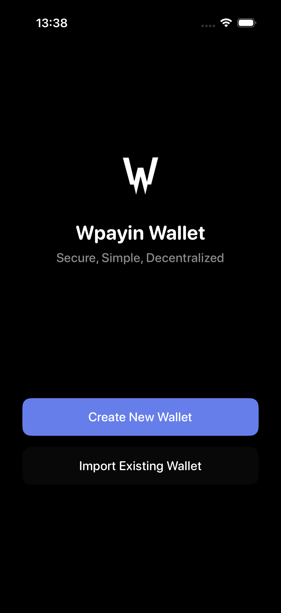
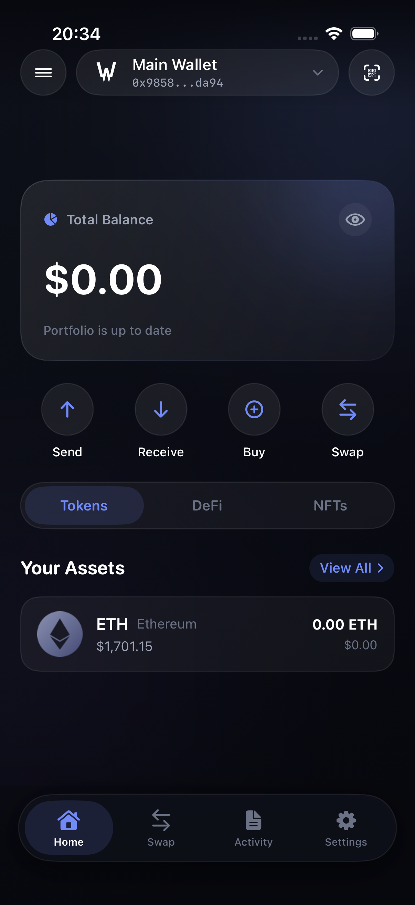
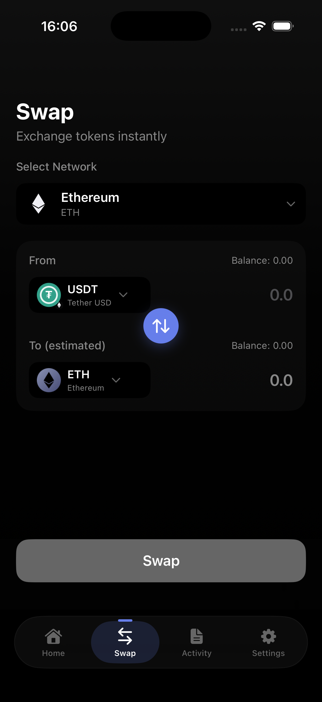

# Wpayin Wallet 1.1.7

Wpayin Wallet is a non-custodial iOS wallet built with SwiftUI and Trust
Wallet Core. It supports Bitcoin, Ethereum, Solana, EVM-compatible networks,
tokens, network-aware transaction history, NFTs, DEX swaps, cross-chain
bridging, and atomic EVM P2P trading.

> This project has not received a professional security audit. Use test
> accounts and small amounts only. You are responsible for protecting your
> recovery phrase and private keys.

<p align="center">
  
  
  
</p>

## Version 1.1.7

- Added cross-chain bridging through LI.FI across Ethereum, Arbitrum, Base,
  Optimism, Polygon, BNB Chain, and Avalanche.
- Replaced the Buy flow with signed P2P offers settled atomically through
  AirSwap contracts, including QR/share import, verification, simulation,
  cancellation, and offer status tracking.
- Added reliable PublicNode RPC endpoints and automatic failover for swaps
  and native balances; failed balance requests no longer overwrite the last
  known value with zero.
- Made transaction history network-aware with network filters, icons, scoped
  token activity, and the correct block explorer for each chain.
- Added live prices with real 24-hour change indicators refreshed every
  60 seconds.
- Added an optional 0.25% platform fee for sends and P2P trades. It remains
  disabled until a valid `PLATFORM_FEE_RECIPIENT` is configured.
- Added a redesigned slippage sheet, localized transaction errors in all
  eight languages, and a new orbital launch animation.

See [RELEASE_NOTES_v1.1.7.md](RELEASE_NOTES_v1.1.7.md) for the complete
release notes.

## Requirements

- macOS with Xcode 16 or newer
- iOS 15.0 or newer
- An Apple development team for installation on a physical device

## Build and run

```bash
git clone https://github.com/Lakylife/wpayin-erc20-ios-app.git
cd wpayin-erc20-ios-app
open Wpayin_Wallet.xcodeproj
```

Xcode resolves the pinned Swift Package Manager dependencies automatically.
Select the `Wpayin_Wallet` scheme, choose an iPhone simulator, and press
`Cmd-R`.

The command-line equivalent is:

```bash
xcodebuild \
  -project Wpayin_Wallet.xcodeproj \
  -scheme Wpayin_Wallet \
  -destination 'generic/platform=iOS Simulator' \
  CODE_SIGNING_ALLOWED=NO \
  build
```

No configuration file needs to be copied or created. Public RPC endpoints and
keyless services provide the base wallet functionality.

## Optional API integrations

NFT discovery and indexed transaction history use optional third-party API
keys. In Xcode, open **Product → Scheme → Edit Scheme → Run → Arguments** and
add the required values under **Environment Variables**:

| Variable | Purpose |
| --- | --- |
| `ALCHEMY_API_KEY` | Ethereum NFT discovery |
| `ETHERSCAN_API_KEY` | Indexed EVM transaction history |
| `COINGECKO_API_KEY` | Optional authenticated CoinGecko access |
| `PLATFORM_FEE_RECIPIENT` | Valid EVM address that enables the optional 0.25% platform fee |

The app still builds and runs when these values are absent. Missing provider
keys disable only their corresponding optional data; a missing or invalid fee
recipient disables platform-fee collection. Do not add credentials to source
files. Any credential shipped in an iOS binary can be extracted, so production
deployments should use restricted keys or a server-side proxy.

## Optional public P2P offer board

Direct P2P offers shared by QR code or the iOS share sheet work without an
Apple cloud entitlement. The public CloudKit offer board is implemented but
disabled by default because iCloud capability requires the paid Apple
Developer Program. Setup instructions and the feature flag are documented in
`Wpayin_Wallet/Core/Config/Config.swift`; a prepared entitlement file is
included at the repository root.

## Supported networks

- Bitcoin (Native SegWit/BIP84)
- Ethereum
- Solana
- BNB Chain
- Polygon
- Arbitrum
- Optimism
- Avalanche C-Chain
- Base

Cross-chain bridging is available between the supported EVM networks listed
above through LI.FI. Native Bitcoin and Solana cannot participate in atomic
EVM P2P settlement; supported wrapped representations include WBTC, cbBTC,
BTCB, and BTC.b where available.

## Project layout

```text
Wpayin_Wallet/
├── Assets.xcassets/
├── Core/
│   ├── API/
│   ├── Config/
│   ├── Managers/
│   └── Services/
├── Models/
├── Resources/
└── Views/
Wpayin_WalletTests/
Wpayin_WalletUITests/
```

The project pins WalletCore, web3swift, CryptoSwift, BigInt, and secp256k1 in
`Package.resolved`.

## Security

- Recovery phrases and private keys are stored in the iOS Keychain with
  `kSecAttrAccessibleWhenUnlockedThisDeviceOnly`.
- App lock supports Face ID, Touch ID, and device-passcode fallback.
- Sensitive wallet data must never be committed, logged, or included in
  screenshots.
- Review [SECURITY.md](SECURITY.md) before using or modifying transaction and
  key-management code.

To report a vulnerability, use a private GitHub security advisory rather than
a public issue.

## License

Released under the [MIT License](LICENSE).
